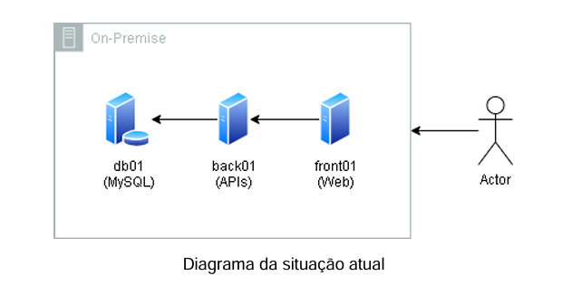
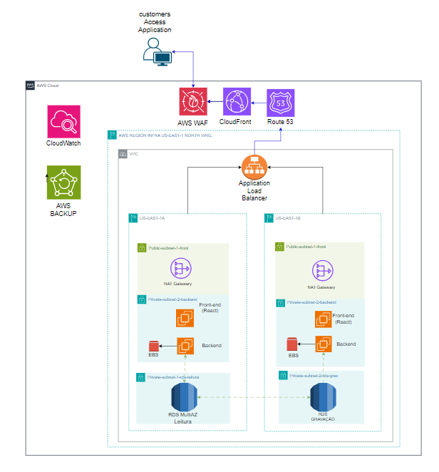
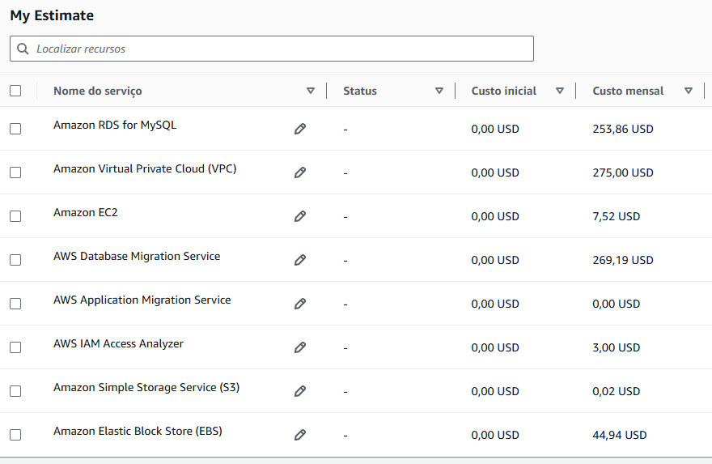
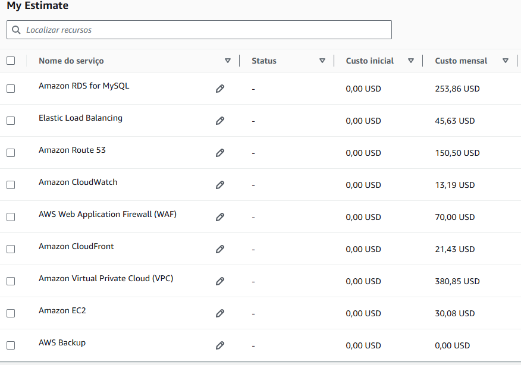
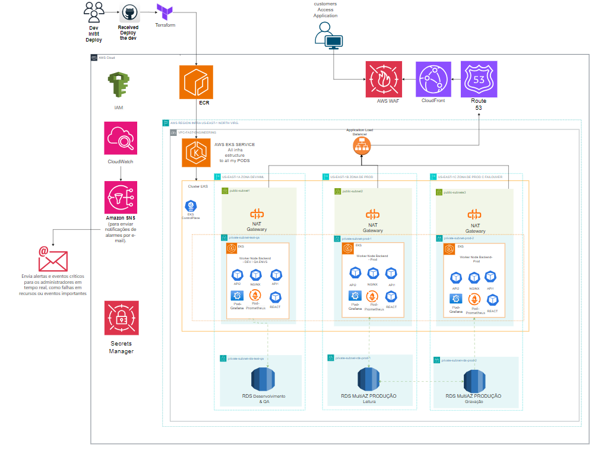

<h1 style="text-align: center;">Migração e Modernização da Infraestrutura para AWS</h1>

#### Este projeto foi desenvolvido como parte de uma tarefa solicitada pela equipe de estágio da Compass.UOL, com o objetivo de aprimorar nossas habilidades e promover o aprendizado. O projeto consiste em dois diagramas: o primeiro ilustra o processo de Lift-and-Shift, migrando servidores locais para a AWS, e o segundo demonstra a transição para uma arquitetura baseada em Kubernetes, utilizando o EKS da AWS.
---

### **Escopo Detalhado**
### **Contexto** 🌍

**Empresa:** Fast Engineering S/A

**Parceiro:** TI Soluções Incríveis

**Situação Atual:**
- Nosso eCommerce está crescendo rapidamente e a infraestrutura atual está sobrecarregada, não atendendo à alta demanda de acessos e compras.
- Infraestrutura atual:
  - **Servidor de Banco de Dados MySQL:** 💾
    - 500GB de dados
    - 10GB de RAM
    - 3 Core CPU
  - **Servidor para Aplicação (Frontend REACT):** 💻
    - 5GB de dados
    - 2GB de RAM
    - 1 Core CPU
  - **Servidor de Backend (3 APIs com Nginx como Balanceador):** 🔧
    - Armazena estáticos como fotos e links
    - 5GB de dados
    - 4GB de RAM
    - 2 Core CPU

# Migração da Infraestrutura de TI para AWS

## Visão Geral

---
## 🛠️ **Fases do Projeto** 🛠️

O projeto será realizado em duas etapas principais:

### **1️⃣ Etapa 1: Lift-and-Shift**
**Migração inicial da infraestrutura para a AWS, sem mudanças significativas, focada em melhorar a performance e escalabilidade, mantendo a estrutura atual.**

---

### **2️⃣ Etapa 2: Modernização com Kubernetes**
**Reestruturação da infraestrutura para adoção de Kubernetes, facilitando escalabilidade, automação e gerenciamento de contêineres.**

- **Ambiente Kubernetes**
- **Banco de dados gerenciado (PaaS e Multi AZ)**
- **Backup de dados**
- **Sistema para persistência de objetos (imagens, vídeos etc.)**
- **Segurança**

---

## Tecnologias Utilizadas  

TTecnologias essenciais para a realização deste projeto.

- 🖥️ Windows 10 – Sistema operacional utilizado para desenvolvimento e administração.
- 🐙 GitHub – Controle de versão e colaboração eficiente no desenvolvimento.
- 🖼️ Git GUI – Interface gráfica para facilitar o gerenciamento de repositórios Git.
- 🔹 AWS CLI – Interface de linha de comando para gerenciamento e automação de serviços AWS, instalada no Windows.
- 🔧 Terraform – Infraestrutura como código (IaC) para provisionamento automatizado e pipelines de CI/CD.
- ☁️ AWS – Plataforma de nuvem para hospedagem, migração e segurança.
- 🐳 Kubernetes – Orquestração de contêineres para escalabilidade e automação.

## Etapa 1️⃣ : Lift-and-Shift  

## Quais atividades são necessárias para a migração?

#### 🔹 1. Preparação do Ambiente AWS
**Configuração da VPC (Virtual Private Cloud):**  
Criar uma rede privada para hospedar as instâncias EC2 e outros recursos necessários.

#### 🔹 2. Configuração de Subnets

**Subnet Pública**  
Hospeda as instâncias de réplica, permitindo comunicação entre a AWS e os servidores de origem.  
As réplicas terão acesso à internet para:
- Comunicação com o servidor de origem.
- Acesso à API do AWS Application Migration Service (MGN).

**Subnets Privadas**  
Destinadas a instâncias EC2 e banco de dados RDS, sem acesso direto à internet.  
Exemplos de recursos alocados:
- Frontend
- Backend
- Banco de dados

#### 🔹 3. Portas de Comunicação para Replicação
A migração exige a abertura de portas específicas para comunicação entre os servidores de origem e a AWS:

| Porta (TCP) | Uso |
| --- | --- |
| 443 | Comunicação entre o servidor de replicação e a API do AWS MGN. |
| 1500 | Transferência segura de dados do servidor de origem para a AWS (comprimido e criptografado). |

#### 🔹 4. Configuração das Ferramentas de Migração

**AWS Application Migration Service (MGN)**  
Criação do serviço AWS MGN, responsável pela replicação contínua dos servidores de origem para a AWS.  
Configuração de EBS para armazenamento de discos replicados, garantindo criptografia (EBS Encryption).

**Criação de Usuário IAM para Replicação**  
Criar um usuário IAM para o AWS Replication Agent.  
Anexar a política AWSApplicationMigrationAgentPolicy.  
(Opcional) Adicionar tags para rastreamento de custos.  
Salvar as credenciais geradas.

**Configuração de Launch Templates**  
Criar um Launch Template para definir as instâncias EC2 replicadas.  
Configurar:

- **AMI (Amazon Machine Image):** Definir a imagem base para as instâncias.
- **Tipo de instância:** Escolher o tipo da instância, como t2.micro
- **VPC e Subnets:** Configurar a rede virtual e subnets para as instâncias.
- **Grupos de segurança:** Definir regras para proteger as instâncias.
- **Chaves SSH:** Adicionar chaves SSH para permitir acesso remoto seguro (se necessário).

#### Execução da Migração
- Instalação do AWS Replication Agent nas máquinas de origem.
- Configuração do AWS DMS (Database Migration Service) para migração do banco de dados MySQL → Amazon RDS.
- Replicação contínua dos servidores para a AWS.

#### Testes Pós-Migração
- Validação de integridade dos dados replicados.
- Testes de desempenho das instâncias EC2 e banco de dados RDS.
- Verificação do funcionamento das aplicações no novo ambiente.

#### Finalização e Otimização
- Desativação dos recursos locais após a validação do sucesso da migração.

## Quais as ferramentas vão ser utilizadas?

A migração será realizada com os seguintes serviços AWS:

| **Serviço**                | **Função**                                                                                  |
|----------------------------|---------------------------------------------------------------------------------------------|
| **AWS MGN**                | Automação para migrar as aplicações locais para a nuvem AWS.                                |
| **AWS Replication Agent**  | Captura e transfere dados para o **Replication Server**.                                   |
| **AWS EC2**                | Computação para replicação dos servidores locais e para testes com servidores migrados.    |
| **AWS S3**                 | O **MGN** se conecta com buckets **S3** para baixar softwares e arquivos de configuração.   |
| **AWS EBS**                | Armazena volumes persistentes durante e após a migração.                                    |
| **AWS RDS**                | Para gerenciar o novo banco de dados na AWS.                                                |
| **AWS DMS**                | Migração do banco de dados MySQL para Amazon **RDS**.                                       |
| **AWS Route 53**           | Gerencia DNS, facilitando a troca de servidores durante a migração.                         |
| **AWS CloudWatch**         | Monitora a performance das instâncias durante a migração e após a conclusão.                |

## Qual o diagrama da infraestrutura na AWS?

Este diagrama ilustra o processo de migração de um servidor local para a infraestrutura da AWS Cloud, destacando as ferramentas e componentes envolvidos na transição, incluindo a migração de dados, aplicativos e a configuração de recursos na AWS.

Pós migração.

## Como serão garantidos os requisitos de Segurança?  

1️⃣ **Controle de Acesso e Autenticação**  
-  **AWS IAM**: Uso de permissões mínimas necessárias (principle of least privilege).  

2️⃣ **Segurança na Replicação e Migração**  
-  **AWS Replication Agent**: Transmissão segura via canais criptografados.  
-  **AWS DMS**: Migração com criptografia ativada.  

3️⃣ **Configuração de Portas Seguras**  

| Porta | Uso |
| --- | --- |
| 443 | Comunicação do AWS MGN com servidores locais. |
| 1500 | Comunicação entre servidores locais e AWS. |
| 3306 | Acesso ao banco MySQL (Amazon RDS). |

4️⃣ **Segurança na Infraestrutura**  
- **VPC Security Groups**: Controle rigoroso de tráfego baseado em regras específicas de entrada e saída.  
- **Network ACLs**: Proteção adicional com regras de filtragem no nível da sub-rede.  

5️⃣ **Uso de CloudFront e Route 53 para Acesso Seguro**  
- **CloudFront**: Distribuição de conteúdo segura e otimizada para usuários finais.  
- **Route 53**: Gerenciamento seguro de DNS para resolução eficiente de nomes de domínio.  

## Como será realizado o processo de Backup?

### 🔹 Backup e Recuperação de Dados  

Garantir a segurança dos dados é essencial. Para isso, utilizamos soluções automatizadas da AWS que garantem a integridade e disponibilidade das informações.  

#### **1. Backup do Banco de Dados (Amazon RDS)**  
- O **Amazon RDS** realiza **backups automáticos**, sem necessidade de intervenção manual.  
- Os dados podem ser **restaurados para um ponto específico no tempo**, caso ocorra alguma falha.  
- A retenção dos backups pode ser configurada conforme a necessidade, garantindo a segurança dos dados a longo prazo.  

#### **2. Backup do Armazenamento (Amazon EBS e AWS Backup)**  
- O **Amazon EBS** gera **snapshots periódicos** dos volumes de armazenamento, permitindo uma rápida recuperação em caso de falhas ou corrupção de dados.  
- O **AWS Backup** automatiza e centraliza esses backups, garantindo maior organização e facilidade na restauração.  
- Com o **AWS Backup**, é possível criar **planos personalizados**, definindo regras de retenção e agendamentos para atender a requisitos de conformidade e recuperação.  

## Qual o custo da infraestrutura na AWS (AWS Calculator)?

Custos da Migração.

Custos pós migração.

---

## **Etapa 2️⃣: Modernização com Kubernetes**

## Quais atividades são necessárias para a migração?

A migração utiliza **Terraform** para provisionar infraestrutura na **AWS**, gerenciando um ambiente baseado em **EKS** (Elastic Kubernetes Service) com suporte para **CI/CD via GitHub**. A arquitetura inclui:

## 🔹 **Fluxo da Infraestrutura**

### 🔹 **IAM (Identity and Access Management)**  
O IAM da AWS gerencia identidades e controla o acesso aos recursos na AWS. 

#### **Principais Funcionalidades:**  
- **Gerenciamento de Permissões:** Define quais usuários, grupos ou funções podem acessar recursos específicos na AWS.  
- **Autenticação Segura:** Permite o uso de autenticação multifator (MFA) para reforçar a segurança.   
---

### 🔹  **GitHub**  
O GitHub é a plataforma para hospedagem e gerenciamento de código-fonte, permitindo controle de versão e colaboração no desenvolvimento para os desenvolvedores e os devops

#### **Principais Funcionalidades:**  
- **Versionamento de Código:** Histórico completo de alterações, facilitando a colaboração e rastreamento de mudanças.  
- **Repositórios Remotos:** Armazenamento seguro e acessível para projetos, com suporte a ramificações, pull requests e revisões de código.  
- **Integração com GitHub Actions:** Automação de fluxos de trabalho, como testes, build e deploy contínuo.  

#### **Automação com GitHub Actions:**  
O **GitHub Actions** permite a criação de pipelines automatizados para CI/CD, garantindo que o código seja:  
- **Construído e testado automaticamente**, evitando falhas antes da implantação.  
- **Enviado para a AWS** a cada atualização no repositório, garantindo um fluxo de deploy eficiente.  

#### **Pré-requisitos para Uso:**  
- **Git instalado no computador:** Necessário para gerenciar repositórios localmente e sincronizar com o GitHub.  
- **Conta no GitHub:** Essencial para criar e gerenciar repositórios, configurar permissões e acessar recursos avançados da plataforma.  

### 🔹 **Terraform**
- Ferramenta de **Infrastructure as Code (IaC)** que permite provisionamento e gerenciamento da infraestrutura de forma automatizada e versionada.

Com arquivos `.tf`, o **Terraform** podemos criar, modificar e destruir recursos na **AWS** conforme configurado.

#### Passos para criar o ambiente com Kubernetes e EKS usando Terraform:

1. **Definir os recursos necessários:**
   - Identificar os recursos necessários no **EKS**, como clusters, namespaces, serviços, deployments e persistent volumes.

2. **Criar arquivos de configuração (.tf):**
   - Escrever arquivos de configuração Terraform (`.tf`) que definem os recursos do **Kubernetes** e **EKS**, incluindo o cluster EKS, nós de trabalho (worker nodes), VPCs, sub-redes e grupos de segurança.

3. **Configurar o cluster Kubernetes:**
   - Utilizar o `kubectl` para configurar o cluster Kubernetes, incluindo a criação de namespaces, serviços, deployments e ingress controllers.

4. **Versionamento e controle de mudanças:**
   - Manter os arquivos de configuração e manifestos Kubernetes em um sistema de controle de versão, como **Git**, para rastrear mudanças e colaborar com a equipe.

5. **Monitoramento e ajustes contínuos:**
    - Monitorar a infraestrutura provisionada e fazer ajustes conforme necessário, utilizando o **Terraform** e o **Kubernetes** para garantir consistência e rastreabilidade.

### 🔹 **Amazon ECR** (Elastic Container Registry)
- Serviço de registro de contêineres Docker usado para armazenar as imagens Docker do **Frontend (React)** e **Backend (APIs, Nginx)**.
- Facilita a integração com o **Amazon EKS** e outras ferramentas da AWS, simplificando o processo de implantação de contêineres.

### 🔹 **Amazon EKS** (Elastic Kubernetes Service)
- Serviço gerenciado de Kubernetes que simplifica a criação e gerenciamento de clusters Kubernetes.
- Distribui os recursos em múltiplas zonas de disponibilidade, oferecendo alta disponibilidade e escalabilidade.

#### **Zonas de Disponibilidade**
- 🔹 **Zona 1** → **Ambiente de Desenvolvimento (Dev)** e **Qualidade (QA)**.
- 🔹 **Zona 2** → **Ambiente de Produção (Prod)**.
- 🔹 **Zona 3** → **Ambiente de Produção (Failover)**.

---

## 🔹 **Componentes da Infraestrutura**

### 🔸 **Rede e Distribuição**

#### **Subnets Públicas**
- **NAT Gateway**: Fornece acesso à internet para instâncias em subnets privadas, permitindo que o backend se comunique com serviços externos de maneira controlada e segura.

#### **Subnets Privadas**
- Usadas para hospedar o **Backend (APIs e Nginx)**.
- O backend é isolado da internet, acessível apenas internamente dentro da infraestrutura do Kubernetes.

### 🔸 **Arquitetura dos Pods**

#### **Backend (Distribuído por Zona de Disponibilidade)**

- **1 Node com 3 Pods:**
  - 📌 **2 Pods** → Contêm as APIs do Backend.
  - 📌 **1 Pod** → Contém o **Nginx**.
  - 📌 **1 Pod** → Contém o **React**.

- **1 Pod para Prometheus** → Monitora a performance dos pods, coletando métricas para observabilidade.
- **1 Pod para Grafana** → Painel de visualização das métricas coletadas pelo Prometheus, permitindo a visualização em tempo real dos dados de performance e saúde da aplicação.

---

### 🔸 **Serviços de Alta Disponibilidade**

- **EKS Control Plane** → Gerencia o cluster Kubernetes, garantindo eficiência na comunicação entre nós e pods, alocando recursos conforme necessário.
- **HPA (Horizontal Pod Autoscaler)** → Escalonamento automático dos pods do backend e frontend com base na carga, garantindo que a infraestrutura cresça ou diminua conforme a demanda.
- **AWS Backup** → Automatiza a criação de backups dos dados em serviços como o RDS, garantindo recuperação em caso de falhas ou desastres.
- **Amazon RDS** → Banco de dados relacional gerenciado, com instâncias distribuídas em cada zona de disponibilidade para redundância e failover automático.

---

### 🔸 **Balanceamento de Carga e Segurança**

- **Amazon Load Balancer** → Distribui o tráfego entre os pods do Kubernetes, garantindo que a carga seja balanceada e evitando sobrecarga de um único pod.
- **CloudFront** → Serviço de **CDN (Content Delivery Network)** para entrega de conteúdo com baixa latência, acelerando a entrega de ativos estáticos como imagens, scripts e estilos do frontend.
- **AWS WAF** → **Web Application Firewall**, protege a aplicação contra ataques de segurança comuns, como SQL injection, Cross-site Scripting (XSS), entre outros. Configurado para proteger o Load Balancer e as aplicações web.
- **AWS Route 53** → Gerenciamento de DNS, com alta disponibilidade. Também gerencia o failover entre zonas de disponibilidade.

---

### 🔸 **Monitoramento**

- **Amazon CloudWatch** → Coleta logs e métricas de performance de todos os recursos da AWS, incluindo **EKS**, **RDS**, **Load Balancer**, entre outros. Permite visibilidade em tempo real sobre o estado da infraestrutura e das aplicações.
- **Amazon SNS** → **Simple Notification Service**, envia alertas e eventos críticos para os administradores em tempo real, como falhas em recursos ou eventos de autoscaling.
- **Secrets Manager** → Armazena e gerencia segredos (como credenciais de banco de dados, chaves de API e dados sensíveis), garantindo que essas informações sejam seguras e acessíveis apenas aos recursos autorizados.

### **Quais as ferramentas vão ser utilizadas?**

A migração será realizada com os seguintes serviços AWS:

| **Serviço**                | **Função**                                                                                  |
|----------------------------|---------------------------------------------------------------------------------------------|
| **IAM**                    | Gerencia permissões e controla o acesso seguro aos recursos da AWS.                         |
| **Git GUI**                | Interface gráfica para gerenciar repositórios Git de forma visual e simplificada.          |
| **Terraform**               | Provisiona e gerencia a infraestrutura como código, criando e configurando os recursos na AWS. |
| **GitHub Actions**         | Automatiza o processo de CI/CD, integrando o GitHub para deploy contínuo na AWS.            |
| **Amazon ECR**              | Armazena e gerencia imagens Docker do backend e frontend.                                   |
| **Amazon EKS**              | Orquestra os containers no Kubernetes, proporcionando escalabilidade e alta disponibilidade. |
| **Amazon EKS Control Plane**| Gerencia o plano de controle do Kubernetes, coordenando a execução e gerenciamento dos nós do EKS. |
| **Helm**                    | Facilita a instalação e gerenciamento de recursos no Kubernetes, como Prometheus e Grafana. |
| **Prometheus**              | Monitora e coleta métricas de performance dos pods e recursos no Kubernetes.                |
| **Grafana**                 | Exibe métricas coletadas pelo Prometheus em dashboards visuais para facilitar o monitoramento. |
| **AWS RDS**                 | Gerencia bancos de dados relacionais com alta disponibilidade e backup automático.         |
| **AWS WAF**                 | Protege a aplicação contra ataques web, bloqueando tráfego malicioso.                      |
| **Amazon CloudFront**       | Distribui conteúdo estático com baixa latência, melhorando a performance do front-end.      |
| **AWS Route 53**            | Gerencia DNS, facilitando a troca de servidores e garantindo alta disponibilidade.          |
| **Amazon Load Balancer**    | Distribui o tráfego entre os pods, garantindo balanceamento de carga e escalabilidade.      |
| **AWS SNS**                 | Envia notificações automáticas sobre eventos críticos ou alertas no sistema.               |
| **AWS Secrets Manager**     | Armazena segredos e credenciais de forma segura, evitando exposição de informações sensíveis. |
| **NAT Gateway**             | Fornece acesso controlado à internet para instâncias em subnets privadas, permitindo que o backend se comunique com serviços externos de forma segura. |

### **Qual o diagrama da infraestrutura na AWS?**

### **Como serão garantidos os requisitos de Segurança?** 

1️⃣ **Proteção contra Ameaças Web**  
- **AWS WAF**: Protege contra ataques como SQL Injection e XSS, bloqueando tráfego malicioso.  

2️⃣ **Gerenciamento Seguro de Credenciais**  
- **AWS Secrets Manager**: Armazena e gerencia credenciais e segredos de forma segura, evitando exposição de informações sensíveis.  

3️⃣ **Controle de Acesso e Autenticação**  
- **AWS IAM**: Define permissões e restringe acessos com base no princípio de privilégios mínimos.  

4️⃣ **Encriptação de Dados**  
- Aplicação automática de criptografia nos serviços da AWS, como **S3 e RDS**, garantindo a proteção de dados sensíveis.  

5️⃣ **Monitoramento e Alertas de Segurança**  
- **Amazon CloudWatch**: Fornece visibilidade e controle sobre os recursos da infraestrutura, gerando alertas de segurança em tempo real.  

6️⃣ **Segurança no Kubernetes (EKS)**  
- **EKS Security Groups**: Garante que apenas tráfego autorizado seja permitido dentro do cluster Kubernetes, utilizando regras de firewall configuradas.  
- Configuração de grupos de segurança para assegurar comunicação segura entre **frontend (subnet pública)** e **backend (subnet privada)**.  

## Como será realizado o processo de Backup?

#### 🔹 **AWS RDS Backup Automático**
- O **AWS RDS Backup Automático** vai fazer backups regulares do banco de dados **RDS** e podemos escolher por quanto tempo queremos guardar esses backups.
- Ele também vai permitir que a gente recupere o banco em um ponto específico no tempo, caso precise voltar a um estado anterior.

#### 🔹 **Automação com CronJobs**
- Vamos usar **CronJobs** para fazer backups automáticos no **EKS** (Elastic Kubernetes Service).
- Isso vai garantir que os backups sejam feitos de forma contínua, sem precisar que alguém faça manualmente.

#### 🔹 **EKS**
- No **EKS**, vamos usar o versionamento dos arquivos para registrar todas as mudanças feitas no cluster. O recurso de *rollout* vai aplicar as mudanças aos poucos, e se algo der errado, podemos voltar a uma versão anterior dos pods para restaurar os dados de forma segura.

#### 🔹 **ECR**
- Vamos organizar os arquivos do **ECR** no **GitHub**. Um script vai ser criado para exportar esses arquivos de forma automática, garantindo que as imagens do **ECR** estejam sempre atualizadas e prontas para serem recuperadas caso seja necessário.

---

## **Qual o custo da infraestrutura na AWS (AWS Calculator)?**

---

[Para mais detalhes, acesse o PDF!](./img/My%20Estimate%20-%20Calculadora%20de%20Preços%20da%20AWS.pdf)

## Conclusão
A migração para a AWS e a modernização com Kubernetes, utilizando o Amazon EKS, foram passos importantes no processo de aprendizagem e crescimento da Fast Engineering S/A. A mudança para a nuvem trouxe vantagens como maior escalabilidade, flexibilidade e segurança, permitindo que a empresa fosse capaz de lidar melhor com o aumento da demanda por acessos e compras. 🚀

O processo de lift-and-shift, que consistiu na migração direta para a nuvem sem grandes mudanças no sistema original, foi uma maneira eficiente de começar a transição para a AWS. Isso permitiu à empresa tirar proveito da nuvem de forma rápida e sem grandes riscos, o que me ajudou a entender a importância de uma migração bem planejada.

A implementação do Kubernetes no Amazon EKS foi um aprendizado crucial. O Kubernetes ajudou a otimizar o gerenciamento de contêineres e garantir que a infraestrutura fosse mais ágil e escalável, permitindo que a empresa crescesse de maneira mais tranquila no futuro. Além disso, entender as práticas de DevOps, como a criação de pipelines de CI/CD, me mostrou como automatizar processos e melhorar a eficiência nas entregas de software.

Com essa experiência, aprendi a importância de aplicar boas práticas de segurança, usar ferramentas como Docker e AWS, e garantir que a infraestrutura seja preparada para suportar crescimento e mudanças. Esse projeto não só me proporcionou uma visão mais ampla sobre infraestrutura em nuvem, mas também me ensinou como as empresas podem se beneficiar de uma arquitetura moderna e escalável. 🌐

